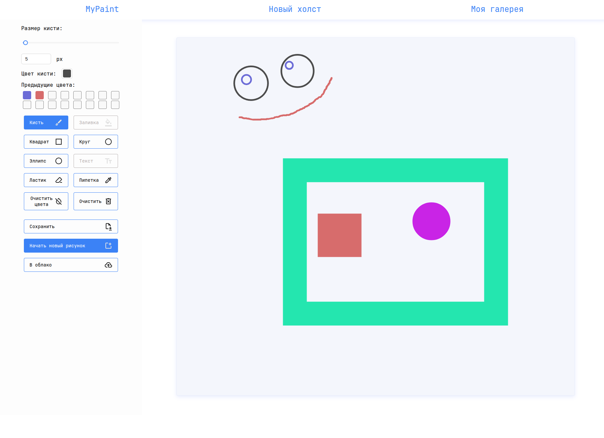

# MyPaint — Онлайн-рисовалка

**MyPaint** — это веб-приложение для создания графических рисунков прямо в браузере без установки дополнительного ПО.



## 🛠️ Стек технологий

### Backend

- **FastAPI** — современный Python-фреймворк для создания API
- **Uvicorn** — ASGI-сервер для FastAPI
- **PostgreSQL** — реляционная база данных
- **Asyncpg** — асинхронный клиент для PostgreSQL
- **PyJWT** — работа с JWT-токенами аутентификации
- **Python-dotenv** — управление переменными окружения

### Frontend

- **React 19** — библиотека для построения пользовательских интерфейсов
- **TypeScript** — строгая типизация кода
- **Vite** — сборщик и dev-сервер
- **Ant Design (antd)** — UI-библиотека компонентов
- **React Router DOM** — навигация по страницам
- **Canvas API** — рисование на HTML5 Canvas

### Инфраструктура

- **Docker** и **Docker Compose** — контейнеризация приложения
- PostgreSQL база данных в Docker-контейнере
- **Prometheus** и **Grafana** - сбор и визуализация метрик

## ✨ Основные возможности

- 🖌️ **Кисть** — рисование свободными линиями с настраиваемым размером и цветом
- 🔷 **Фигуры** — квадрат, круг и эллипс с точной настройкой размеров
- 🎨 **Палитра цветов** — выбор цвета и история использованных цветов
- 🧽 **Ластик** — удаление элементов рисунка
- 👁️ **Пипетка** — выбор цвета с холста
- 💾 **Сохранение** — загрузка рисунка на локальное устройство
- ☁️ **Облачное хранилище** — сохранение рисунков на сервере для доступа с разных устройств (требуется авторизация)

## 🚀 Запуск проекта

1. Клонируйте репозиторий:

```bash
git clone https://github.com/StarFury-gh/mypaint.git
cd mypaint
```

2. Запустите контейнеры:

```bash
docker-compose up --build
```

3. Откройте фронтенд в браузере:

```
http://localhost:8080
```

## 📂 Структура проекта

```
mypaint/
├── backend/           # API на FastAPI
├── frontend/          # React-приложение
├── infra/             # Инфраструктура (Docker, БД)
├── docker-compose.yml
└── README.md
```
